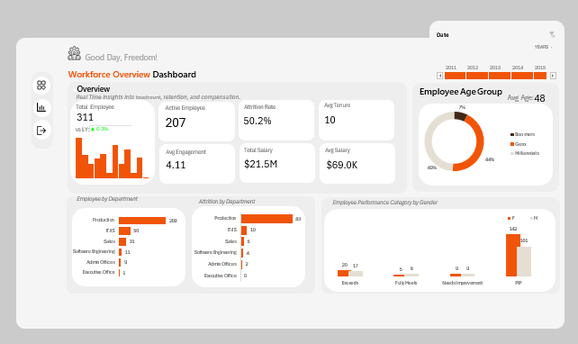

# HR Analytics Dashboard using Excel

## Project Overview

This project presents an HR Analytics Dashboard developed using Microsoft Excel to analyze workforce composition, employee movement, department distribution, performance, demographics, compensation, tenure, engagement, and monthly workforce trends.

The objective is to transform HR workforce data into structured KPIs and visual insights that support data-driven workforce analysis.

## Business Objectives

* Analyze overall workforce composition
* Monitor active and terminated employees
* Analyze employee distribution by department
* Understand employee demographics
* Analyze employee performance categories
* Examine salary and tenure metrics
* Analyze employee engagement
* Identify monthly workforce trends
* Present HR KPIs through an interactive dashboard

## Tools & Technologies

* Microsoft Excel
* PivotTables
* PivotCharts
* Power Pivot
* DAX
* Data Cleaning
* Data Transformation
* Data Modeling
* KPI Analysis
* Data Visualization
* HR Analytics

## Data Analysis Process

### 1. Data Preparation

* Reviewed and prepared the HR dataset
* Checked data structure and fields
* Performed required cleaning and aggregation

### 2. Data Modeling

* Created a Power Pivot data model
* Organized data for analytical reporting
* Used relationships/measures where required

### 3. DAX Analysis

Used DAX measures to calculate and present HR KPIs and analytical metrics consistently across dashboard views.

### 4. Pivot Analysis

Created PivotTables to summarize workforce data across departments, demographics, performance and employee movement.

### 5. Visualization

Created PivotCharts to communicate workforce trends and distributions through an interactive dashboard.

## Key KPIs

| KPI                  |                   Value |
| -------------------- | ----------------------: |
| Total Employees      |                     311 |
| Active Employees     |                     207 |
| Terminated Employees |                     104 |
| Average Salary       |      Approximately $69K |
| Average Tenure       | Approximately 9.8 years |
| Average Engagement   |                    4.11 |

## Dashboard Analysis

The dashboard includes:

* Employee distribution by department
* Employee age-group analysis
* Performance distribution
* Gender distribution
* Termination analysis
* Salary analysis
* Tenure analysis
* Employee engagement analysis
* Monthly workforce trends

## Key Insights

* Production represents the largest employee population in the analyzed dataset.
* Employee movement varies across departments.
* Performance categories provide a view of workforce performance distribution.
* Average salary is approximately $69K across the analyzed employee population.
* Age-group analysis provides visibility into workforce demographics.
* Engagement and tenure metrics provide additional workforce context.

## Dashboard Preview

## Project File

[Download / View the Excel Dashboard](HR_Analytics_Dashboard_Excel.xlsx)

## Skills Demonstrated

* Excel Data Analysis
* PivotTables
* PivotCharts
* Power Pivot
* DAX
* Data Modeling
* KPI Development
* Data Visualization
* HR Analytics
* Business Analysis

## Author

**PriyaDharshini**

Data Analyst Fresher

Excel | SQL | Python | Power BI | Tableau | Power Pivot | DAX

